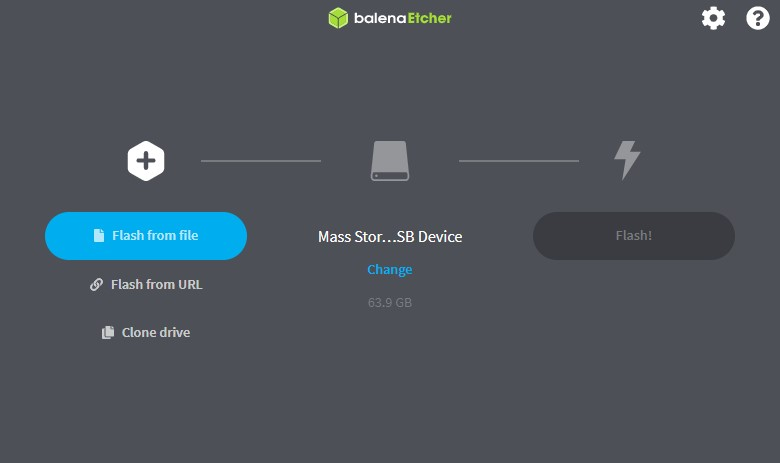

# INSTALAÇÃO DO S.O
- Primeiramente baixe:
  - [Etcher](https://www.balena.io/etcher/)
  - [Jetson Nano Developer Kit SD Card Image| V4.6](https://developer.nvidia.com/embedded/l4t/r32_release_v6.1/jeston_nano/jetson-nano-jp46-sd-card-image.zip)
    - Caso o link não funcione, baixe direto do Jetson download Center : https://developer.nvidia.com/embedded/downloads#?search=nano

- Use o etcher para instalar a imagem Jetson Nano Developer Kit SD Card Image no cartão Micro SD:

